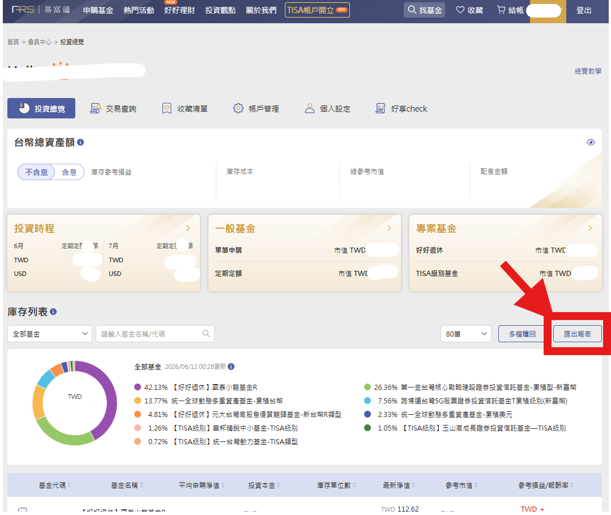

# 📈 基金與股票追蹤 Fund Tracker

免登入、免安裝的基金、股票與 ETF 投資組合追蹤工具。單一 HTML 檔案的 PWA，開啟即用，投資組合資料只存在你自己的瀏覽器裡。

**🔗 線上使用：<https://zxcv900583.github.io/fund-tracker/>**

手機瀏覽器開啟後可「加入主畫面」當 App 使用；或直接下載 `index.html` 雙擊開啟。

## 特色

- **免登入追蹤淨值**——涵蓋台灣核備的境內外基金（資料來源 Morningstar 公開 API，免金鑰），每日淨值自動更新，歷史資料約 10 年
- **股票／ETF 持倉**——搜尋 `2330`、`0050`、`AAPL`、`SPY` 等代碼，以「股數 × 每股成交價 + 手續費」計算成本；台股支援零股，美股支援小數股
- **跨資產比較**——庫存基金、股票／ETF 與 16 個主要指數可混合選擇最多 6 條走勢，比較 1 個月至 10 年的歷史相對報酬
- **營業日短區間**——主圖與比較圖支援 1、2、5、21 個營業日；不把週末或休市日誤算成交易日
- **行動版操作**——手機底部固定新增、更新與比較操作列；每筆持倉的買入、管理、比較與刪除集中在表格最右操作欄，圖表與按鈕同步放大
- **市場狀態**——台灣加權與櫃買顯示最新交易日；台股平日 09:00～13:30 顯示交易中，13:30 起標示已休市
- **客製漲跌色**——工具列可一鍵對調上漲與下跌顏色，偏好會保存在瀏覽器並套用到持倉、股市卡片與主圖
- **淨值更新診斷**——手動更新會強制查詢資料源，完成後顯示實際 API 最新淨值日、取得新資料筆數及失敗筆數；沒有新資料時不再誤稱更新成功
- **資產類型標籤**——持倉名稱前清楚標示「基金」或「股票」，混合資產列表可快速辨識
- **手機大圖模式**——股市來源與更新時間合併到淨值狀態列，市場卡片不再浪費左側空間；主圖加高並保留日期軸留白，可垂直捲動查看完整曲線
- **基富通報表一鍵匯入**——基富通網站「投資總覽 → 匯出報表」下載的 CSV 直接匯入，自動比對基金級別（含 TISA、好好退休 R 類、外幣級別），整個投資組合 30 秒搬進來；也可匯出成相同格式
- **定期定額排程**——設定「每月幾日扣多少」，開啟時自動用扣款日（假日順延）淨值補上記錄，不用手動記帳
- **金額買入**——輸入金額＋手續費自動換算單位數，成本計算含手續費
- **配息記錄**——損益與報酬率均為含息計算；配息再投入也能正確處理
- **投資組合走勢圖**——總現值 vs 累計投入成本曲線、含息報酬指數
- **XIRR 年化報酬**——金額加權年化報酬率，定期定額投資人真正該看的指標
- **走勢圖**——3 天～10 年共 12 種區間＋自訂，買入點標記、持倉均價線、% / 淨值雙模式
- **CSV 批次匯入**——逐筆交易格式（UTF-8 / Big5 皆可），淨值空白自動查詢，重複自動略過
- **資料自主**——localStorage 本地儲存，一鍵 JSON 備份／還原，不上傳任何伺服器
- 深色模式、手機 RWD、PWA 離線快取

## 使用方式

1. 開啟[網頁](https://zxcv900583.github.io/fund-tracker/)
2. 「＋ 新增基金」搜尋名稱或 ISIN；「＋ 股票/ETF」搜尋商品代碼；也可點「CSV」匯入基富通報表
3. 點「⟳ 更新」抓取最新淨值與歷史資料
4. 點任一基金看走勢，點「📊 組合」看整體資產曲線
5. 點「比較」或持倉列的「比較」，混合比較庫存基金、股票與全球市場

基富通的報表在「會員中心 → 投資總覽」的庫存列表右上角「匯出報表」下載：



> 💡 換裝置時用「匯出」下載 JSON 備份，再到新裝置「匯入」即可。

## 隱私與免責

- 本工具**不收集任何投資組合資料**：持倉只存在瀏覽器 localStorage；資料請求由專案的 Cloudflare Worker 代理至 Yahoo Finance、Morningstar、臺灣證交所與集保 TDCC
- Yahoo Finance 端點並非正式公開 API，資料可能延遲、異動或暫時中斷；Worker 依序嘗試 Yahoo query1、query2、臺灣證交所官方台股備援，最後使用 Cloudflare KV 最近成功快取
- 淨值與計算結果僅供參考，非投資建議；實際數字以銷售機構對帳單為準

## 技術

前端為單檔 HTML + Chart.js。資料透過受限 Cloudflare Worker 取得，Worker 只接受固定路由與通過驗證的商品代碼、基金 ID、ISIN、日期、區間及頻率，不提供任意網址代理。

重新部署 Worker：

```powershell
wrangler deploy -c worker/wrangler.jsonc
```

Worker 端點：

- `GET /health`
- `GET /health?deep=1`
- `GET /api/assets/search?q=2330`
- `GET /api/yahoo/quotes?symbols=^TWII,^GSPC`
- `GET /api/yahoo/chart?symbol=^GSPC&range=10y&interval=1wk`
- `GET /api/funds/search?term=統一奔騰`
- `GET /api/funds/history?secId=F0HKG05X2C&currency=TWD&start=2026-01-01&end=2026-06-12`
- `GET /api/funds/tdcc?isin=LU0820562030`

本機驗證：

```powershell
node tests/api-smoke.mjs
node tests/e2e.mjs
wrangler deploy --dry-run -c worker/wrangler.jsonc
```

詳細規格見 [fund-tracker-spec.md](fund-tracker-spec.md)。

## License

[MIT](LICENSE)
